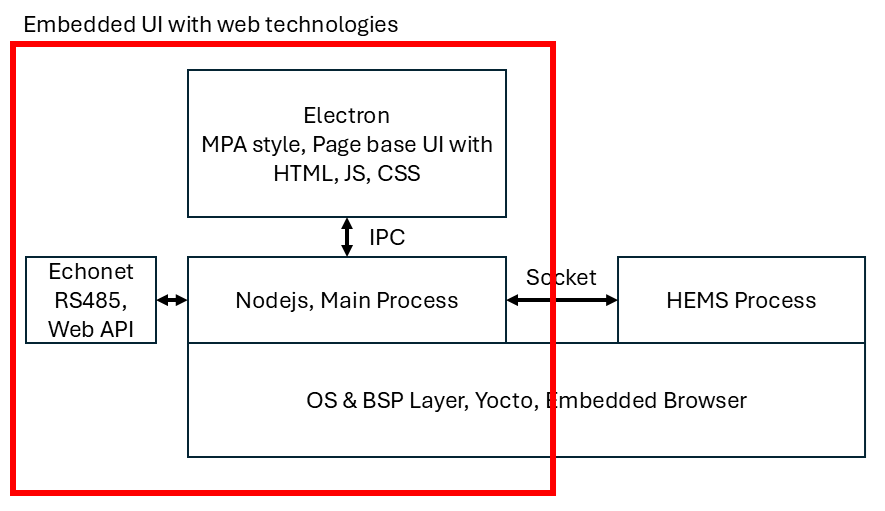

# Electron Sharp Prototype

Japanese solar home appliance assessment case in 2025.

This technical evaluation example itself uses another NodeJS backend to asynchronously update the front-end React GUI using RPC.

The source of the network data is the free API of the Bitcoin exchange, which can read Bitcoin quotes, but it has expired, so the Bitcoin-related quote functions and real-time charts in the GUI can no longer display real-time quotes.

## Architecture




## Run

```bash
npm install

# Two consoles need to be started

## Console 1
npm start

## Console 2
electron --no-sandbox --disable-gpu --ozone-platform=wayland .
```

## Epilogue

In December 2024, I flew to Osaka, Japan with my colleagues, suffering from a cold and fever, to compete for this order. In the end, I did not win this multinational ODM business. As it concerns my career development, I am already an older practitioner in the software industry. This failure was a major setback, and fate did not smile on me.

Perhaps because I had cried all my tears dry, I was in such a painful state that I didn't even shed a single tear. This pain will be unforgettable for me.

在2024年的12月，我抱著感冒發燒的身體跟著同事們飛到了日本大阪去爭取這筆訂單，最終我並沒有爭取到這個跨國的ODM生意，由於事關職業發展，在軟體業我已經算是年齡較大的從業者，這次失敗屬於一次重大的挫敗，命運並沒有對我微笑。

也許是眼淚已經流乾，在如此痛苦的心情下，連一滴眼淚都沒有，這種痛苦我終身難忘。

